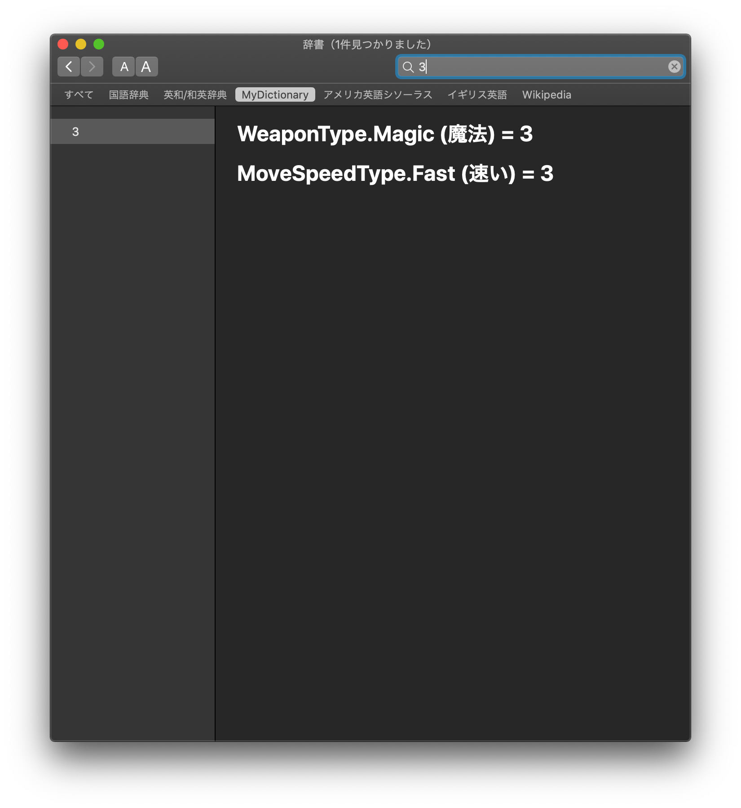

NAME

number dictionary

USAGE

1. edit bin/setting.data
1. `make template`
1. edit bin/list.sh
1. `make instantiate`
1. `make build`
1. `make install`

IMAGE

OTHER RESOURCE

If the dictionary uses images, then,

1. make make_icon_path returns relative path below
1. mkdir dictionary/OtherResources
1. place images in OtherResources.

See detail in `Dictionary Development Kit/documents/Dictionary Development Kit.rtf`.

PREPARE

This requires `Dictionary Development Kit` where in `Additional Tools for Xcode`.

Get it from: https://developer.apple.com/download/more/
